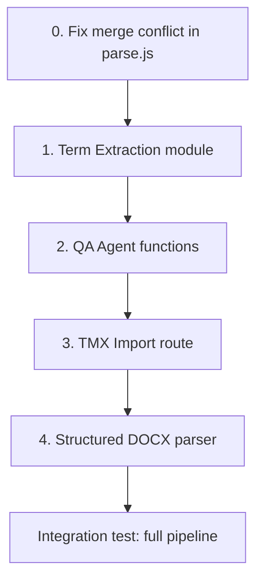

# DeepTrans Feature Integration — Implementation Plan

Integrate 4 features from DeepTrans Studio into ClearLingo's existing architecture, plus fix a pre-existing merge conflict.

---

## Pre-Requisite: Fix Merge Conflict

> [!CAUTION]
> `server/routes/parse.js` has a git merge conflict at lines 78-83 that will cause a syntax error. This **must** be resolved before any other work.

#### [MODIFY] [parse.js](file:///d:/Codes/Hackathon/server/routes/parse.js)

Replace the conflicted block (lines 78-83) with the HEAD version since it's the more permissive approach:

```diff
     if (text.length > 3) {
-<<<<<<< HEAD
       // Split ANY format type (paragraphs, list items, quotes) if it exceeds 150 chars
       if (text.length > 150 && formatType !== 'heading') {
-=======
-      if (formatType === 'paragraph' && text.length > 100) {
->>>>>>> 2d2b5596095e5108100c363907148383774bd963
         const sentences = smartSplit(text);
```

**Test:** Start the server (`npm run server`) and confirm no syntax errors.

---

## Feature 1: Pre-Translation Term Extraction

**Goal:** Before translating a document, scan all source text with an LLM to discover domain-specific terms not in the glossary. Inject those into the translation prompt for consistent handling.

**Impact:** HIGH — prevents inconsistent translation of unknown terms across segments.

### Step 1.1 — Create `server/term-extractor.js`

#### [NEW] [term-extractor.js](file:///d:/Codes/Hackathon/server/term-extractor.js)

A new module with two exported functions:

```javascript
// server/term-extractor.js

import { isMockMode } from './gemini.js';

// Needs access to flashModel — import the raw Gemini client
import { GoogleGenerativeAI } from '@google/generative-ai';
import 'dotenv/config';

let flashModel = null;
if (!isMockMode() && process.env.GEMINI_API_KEY) {
  const genAI = new GoogleGenerativeAI(process.env.GEMINI_API_KEY);
  flashModel = genAI.getGenerativeModel({ model: 'gemini-2.0-flash' });
}
```

**Function 1: `extractTerms(sourceText, sourceLang)`**

- **Input:** Full concatenated source text (all segments joined with `\n`), source language code.
- **Prompt:**
  ```
  You are a terminology extraction specialist.
  Analyze the following {sourceLang} text and extract ALL:
  - Domain-specific terminology (legal, medical, financial, technical)
  - Proper nouns and named entities
  - Technical acronyms and abbreviations
  - Terms that should be translated consistently across a document

  Return ONLY a JSON array: [{"term": "...", "category": "legal|medical|finance|technical|general"}]
  No explanations. No markdown fences.
  ```
- **Output:** Parsed JSON array, or `[]` on parse failure.
- **Mock mode:** Return a hardcoded array of 3 demo terms (e.g., `authorization`, `compliance`, `stakeholder`).
- **Error handling:** Wrap in try/catch, return `[]` on any failure. Log warning.

**Function 2: `crossReferenceGlossary(discoveredTerms, existingGlossary)`**

- **Input:** The array from `extractTerms()`, the existing glossary array `[{source, target}]`.
- **Logic:** For each discovered term, check if `term.term.toLowerCase()` matches any `glossary.source.toLowerCase()`.
- **Output:** `{ known: [...], unknown: [...] }` — unknown terms are the ones the glossary doesn't cover.

### Step 1.2 — Wire into `llm-orchestrator.js` → `translateBatch()`

#### [MODIFY] [llm-orchestrator.js](file:///d:/Codes/Hackathon/server/llm-orchestrator.js)

**Where (line ~18):** Add import at the top of the file:
```javascript
import { extractTerms, crossReferenceGlossary } from './term-extractor.js';
```

**Where (line ~509, after the glossary fetch and before the `for` loop):** Insert the term extraction step:

```javascript
// ═══ NEW (DeepTrans): Document-level term extraction ═══
const fullSourceText = segments.map(s => s.sourceText).join('\n');
const discoveredTerms = await extractTerms(fullSourceText, sourceLang);
const { known, unknown } = crossReferenceGlossary(discoveredTerms, glossary);

if (unknown.length > 0) {
  console.log(`   🔍 ${unknown.length} new terms discovered: ${unknown.map(t => `"${t.term}"`).join(', ')}`);
}
```

**Where (line ~555, the `relevantGlossary` filter):** After the existing glossary filter, append unknown terms as "soft" entries the prompt should be aware of:

```javascript
// Inject discovered-but-unglossaried terms as hints
const termHints = unknown
  .filter(t => new RegExp(`\\b${escapeRegex(t.term)}\\b`, 'i').test(seg.sourceText))
  .map(t => ({ source: t.term, target: `[translate consistently: ${t.term}]` }));

const allGlossary = [...relevantGlossary, ...termHints];
```

Then pass `allGlossary` instead of `relevantGlossary` to `translateSegment()`.

### Step 1.3 — Test

1. Start the server: `npm run server`
2. Upload a test DOCX with domain-specific terms (e.g., a legal document mentioning "indemnification", "force majeure").
3. Check server logs for `🔍 New terms discovered:` messages.
4. Verify that the discovered terms appear consistently translated across segments.
5. **If MOCK_MODE:** Verify the hardcoded demo terms are returned without errors.

---

## Feature 2: Post-Translation QA Agent

**Goal:** After each LLM-translated segment, run a second LLM call to audit for semantic errors (missing info, wrong numbers, grammar issues). Store results for human review.

**Impact:** HIGH — catches errors that deterministic glossary checks miss.

### Step 2.1 — Add DB schema for QA results

#### [MODIFY] [db.js](file:///d:/Codes/Hackathon/server/db.js)

**Where (line ~253, after the `glossary_checks` table):** Add a new table:

```sql
-- ═══ QA Agent Results — per-segment translation quality audit ═══
CREATE TABLE IF NOT EXISTS qa_results (
  id          INTEGER PRIMARY KEY AUTOINCREMENT,
  segment_id  TEXT NOT NULL,
  project_id  INTEGER,
  source_text TEXT NOT NULL,
  target_text TEXT NOT NULL,
  passed      INTEGER DEFAULT 1,
  issues      TEXT,           -- JSON array of issue strings
  checked_at  TEXT DEFAULT (datetime('now'))
);
```

### Step 2.2 — Add QA function to `server/gemini.js`

#### [MODIFY] [gemini.js](file:///d:/Codes/Hackathon/server/gemini.js)

**Where (line ~206, after the `validateWithGemini` function):** Add a new exported function:

```javascript
/**
 * Post-translation QA: Audits a single translation for semantic errors.
 * Returns { passed: boolean, issues: string[] }
 */
export async function qaCheckTranslation(sourceText, translatedText, targetLang) {
  if (MOCK_MODE) {
    // In mock mode, randomly flag ~10% of segments for realism
    if (Math.random() < 0.1) {
      return { passed: false, issues: ['[Mock] Possible tone inconsistency detected'] };
    }
    return { passed: true, issues: [] };
  }

  const langName = LANG_DISPLAY[targetLang] || targetLang;

  const prompt = `You are a translation quality auditor for ${langName}.
Compare the source text and its translation. Check for:
1. Missing or added information (content not in the original)
2. Number, date, or proper noun errors
3. Grammar issues in the target language
4. Tone inconsistency (too casual/formal vs the original)

Source (English): "${sourceText}"
Translation (${langName}): "${translatedText}"

Return ONLY a JSON object with no markdown fences:
{"passed": true, "issues": []}
If there are problems:
{"passed": false, "issues": ["issue description 1", "issue description 2"]}`;

  try {
    const result = await flashModel.generateContent(prompt);
    const raw = result.response.text()
      .replace(/```json\n?/g, '').replace(/```\n?/g, '').trim();
    return JSON.parse(raw);
  } catch (err) {
    console.warn(`⚠ QA check parse failed: ${err.message}`);
    return { passed: true, issues: [] }; // fail-open: don't block translation
  }
}
```

### Step 2.3 — Wire into `llm-orchestrator.js` → `translateBatch()`

#### [MODIFY] [llm-orchestrator.js](file:///d:/Codes/Hackathon/server/llm-orchestrator.js)

**Where (line ~20):** Add to the import from `./gemini.js`:
```javascript
import {
  translateText,
  validateWithGemini,
  qaCheckTranslation,    // ← NEW
  isMockMode,
} from './gemini.js';
```

**Where (line ~577, after glossary enforcement and before the DB update):** Add the QA check:

```javascript
// ═══ NEW (DeepTrans): Post-translation QA audit ═══
let qaIssues = [];
let qaPassed = true;
if (matchType === 'NEW') {
  // Only QA-check segments that went through full LLM (not cached, not TM)
  try {
    const qa = await qaCheckTranslation(seg.sourceText, llmResult.targetText, targetLang);
    qaPassed = qa.passed;
    qaIssues = qa.issues || [];
    if (!qaPassed) {
      console.log(`   ⚠️ QA [${seg.index}]: ${qaIssues.join('; ')}`);
    }
  } catch (qaErr) {
    console.warn(`   ⚠ QA check failed: ${qaErr.message}`);
  }
}
```

**Where (line ~594, the DB update for the segment):** After the existing `UPDATE segments` statement, add:

```javascript
// Persist QA results
if (qaIssues.length > 0 || !qaPassed) {
  db.prepare(
    `INSERT INTO qa_results (segment_id, project_id, source_text, target_text, passed, issues)
     VALUES (?, ?, ?, ?, ?, ?)`
  ).run(seg.id, projectId, seg.sourceText, llmResult.targetText, qaPassed ? 1 : 0, JSON.stringify(qaIssues));
}
```

**Where (the result object, line ~581):** Add QA data to the per-segment result:

```javascript
const result = {
  id: seg.id,
  sourceText: seg.sourceText,
  targetText: llmResult.targetText,
  tmScore: tmResult.score,
  matchType,
  violation: enforcement.violated,
  qaIssues,          // ← NEW
  qaPassed,          // ← NEW
  llmSkipped: false,
  cached: llmResult.cached,
  model: llmResult.model,
  tokens: llmResult.tokens,
};
```

### Step 2.4 — Expose QA results via API

#### [MODIFY] [index.js](file:///d:/Codes/Hackathon/server/index.js)

**Where (line ~76, after the segments endpoint):** Add a new endpoint:

```javascript
// Get QA results for a project
app.get('/api/qa-results/:projectId', (req, res) => {
  try {
    const results = db.prepare(
      'SELECT * FROM qa_results WHERE project_id = ? ORDER BY id DESC'
    ).all(req.params.projectId);
    res.json(results);
  } catch (err) {
    res.status(500).json({ error: err.message });
  }
});
```

### Step 2.5 — Test

1. Upload and translate a document with intentionally tricky content (mixed numbers, dates).
2. Check server logs for `⚠️ QA` messages.
3. `GET /api/qa-results/:projectId` — verify QA issues are stored.
4. In MOCK_MODE, ~10% of segments should have mock QA issues.

---

## Feature 3: TMX Import Route

**Goal:** Allow uploading industry-standard `.tmx` files to bootstrap the Translation Memory with pre-verified pairs from professional tools (SDL Trados, memoQ, etc.).

**Impact:** MEDIUM — lets users bring existing professional TM data into ClearLingo.

### Step 3.1 — Install dependency

```bash
npm install fast-xml-parser
```

> [!NOTE]
> `fast-xml-parser` is the same parser DeepTrans uses for DOCX/XML processing. It has zero dependencies and is ~100KB.

### Step 3.2 — Create `server/routes/import-tm.js`

#### [NEW] [import-tm.js](file:///d:/Codes/Hackathon/server/routes/import-tm.js)

```javascript
import { Router } from 'express';
import multer from 'multer';
import { XMLParser } from 'fast-xml-parser';
import ragEngine from '../rag-engine.js';
import db from '../db.js';

const router = Router();
const upload = multer({ storage: multer.memoryStorage() });
```

**Route: `POST /`**

- **Input:** Multipart form with `file` (`.tmx` or `.csv`), `sourceLang` (default `'en'`), `targetLang` (default `'hi_IN'`).
- **TMX parsing logic:**
  1. Parse the XML buffer with `XMLParser({ ignoreAttributes: false, attributeNamePrefix: '@_' })`.
  2. Navigate to `obj.tmx.body.tu` — normalize to array.
  3. For each `<tu>`:
     - Extract `<tuv>` elements, normalize to array.
     - Find the tuv matching `sourceLang` by checking `tuv['@_xml:lang']`.
     - Find the tuv matching `targetLang` (compare first 2 chars).
     - If both found, call `ragEngine.tmWrite()` with the source/target text pair.
  4. Track `imported` count.
- **CSV fallback:** If the file extension is `.csv`, split by lines, then by comma/tab. First column = source, second column = target. Call `ragEngine.tmWrite()` for each row.
- **Response:** `{ imported: N, total: M, duplicatesSkipped: K }`
- **Error handling:** 400 if no file, 400 if unsupported format, 500 with message on parse failure.

### Step 3.3 — Register the route in `server/index.js`

#### [MODIFY] [index.js](file:///d:/Codes/Hackathon/server/index.js)

**Where (line ~14):** Add import:
```javascript
import importTmRouter from './routes/import-tm.js';
```

**Where (line ~46, after the analytics route):** Register:
```javascript
app.use('/api/import-tm', importTmRouter);
```

**Where (line ~257, the console.log route list):** Add:
```javascript
console.log(`     POST /api/import-tm         — TMX/CSV translation memory import`);
```

### Step 3.4 — Test

1. Create a minimal test TMX file:
   ```xml
   <?xml version="1.0" encoding="UTF-8"?>
   <tmx version="1.4">
     <body>
       <tu>
         <tuv xml:lang="en"><seg>Hello world</seg></tuv>
         <tuv xml:lang="hi"><seg>नमस्ते दुनिया</seg></tuv>
       </tu>
     </body>
   </tmx>
   ```
2. `POST /api/import-tm` with the file + `sourceLang=en` + `targetLang=hi_IN`.
3. Verify response shows `imported: 1`.
4. Upload a test document containing "Hello world" → verify TM EXACT match.

---

## Feature 4: Structured DOCX Parser (Format-Preserving)

**Goal:** Add an alternative DOCX parser that preserves per-run formatting (bold, italic, color) from the original document, enabling format-faithful export reconstruction.

**Impact:** MEDIUM — only needed for high-fidelity export. Current mammoth parser still works for basic use.

### Step 4.1 — Create `server/parsers/docx-structured.js`

> [!NOTE]  
> `fast-xml-parser` is already installed from Feature 3. `jszip` is already a dependency (used in PPTX parsing).

#### [NEW] [docx-structured.js](file:///d:/Codes/Hackathon/server/parsers/docx-structured.js)

**Exports:** `parseDocxStructured(buffer)` → Returns `StructuredSegment[]`

**StructuredSegment shape:**
```typescript
{
  text: string,                // Full paragraph text
  formatType: 'heading' | 'paragraph' | 'list_item',
  runs: [                     // Per-run formatting metadata
    {
      text: string,
      bold: boolean,
      italic: boolean,
      underline: boolean,
      color: string | null,   // hex e.g. "FF0000"
      fontSize: number | null, // half-points e.g. 28 = 14pt
    }
  ]
}
```

**Implementation steps:**
1. Use `JSZip.loadAsync(buffer)` to unzip the DOCX.
2. Read `word/document.xml` via `zip.file('word/document.xml').async('string')`.
3. Parse with `XMLParser({ ignoreAttributes: false, attributeNamePrefix: '@_', removeNSPrefix: true })`.
4. Navigate to `doc.document.body.p` — normalize to array of paragraphs.
5. For each paragraph `p`:
   - Detect if it's a heading by checking `p.pPr.pStyle['@_val']` for patterns like `Heading1`, `Title`.
   - Iterate `p.r` (runs) — normalize to array.
   - For each run `r`:
     - Extract text from `r.t` (handle both string and `{ '#text': ... }` shapes).
     - Read `r.rPr` for: `b` (bold), `i` (italic), `u` (underline), `color['@_val']`, `sz['@_val']`.
   - Concatenate run texts → `text`.
   - Skip if `text.trim().length < 3`.
   - Push `{ text, formatType, runs }`.
6. Return the array.

### Step 4.2 — Integrate into `parse.js` as an option

#### [MODIFY] [parse.js](file:///d:/Codes/Hackathon/server/routes/parse.js)

**Where (line ~6):** Add import:
```javascript
import { parseDocxStructured } from '../parsers/docx-structured.js';
```

**Where (line ~284, the request body parsing):** Read an optional `preserveFormatting` flag:
```javascript
const preserveFormatting = req.body.preserveFormatting === 'true';
```

**Where (line ~293, the DOCX case in the switch):** Add a branch:
```javascript
case 'docx':
  segments = preserveFormatting
    ? await parseDocxStructured(req.file.buffer)
    : await parseDocx(req.file.buffer);
  break;
```

### Step 4.3 — Store run metadata in the segments table

#### [MODIFY] [db.js](file:///d:/Codes/Hackathon/server/db.js)

**Where (line ~280, the segments migrations):** Add a new column:
```javascript
addColumnIfNotExists('segments', 'runs_metadata', 'TEXT');  // JSON blob of formatting runs
```

#### [MODIFY] [parse.js](file:///d:/Codes/Hackathon/server/routes/parse.js)

**Where (line ~333, the `insertSegment` prepared statement):** Add `runs_metadata` to the INSERT:
```sql
INSERT INTO segments (id, project_id, idx, source_text, target_text, original_target,
  tm_score, match_type, status, violation, format_type, runs_metadata)
VALUES (?, ?, ?, ?, ?, ?, ?, ?, 'PENDING', ?, ?, ?)
```

**Where (line ~357, the `.run()` call):** Pass `JSON.stringify(segments[idx].runs) || null` as the last parameter.

### Step 4.4 — Update export to use run metadata

#### [MODIFY] [export.js](file:///d:/Codes/Hackathon/server/routes/export.js)

**Where (line ~80, the DOCX export section):** For each segment, check if `runs_metadata` exists. If so, reconstruct the paragraph using the original formatting:

```javascript
const paragraphs = segments.map((seg) => {
  const formatType = seg.format_type || 'paragraph';
  const text = seg.target_text;

  // If we have original run metadata, reconstruct with original formatting
  let runsData = null;
  try {
    runsData = seg.runs_metadata ? JSON.parse(seg.runs_metadata) : null;
  } catch {}

  if (runsData && runsData.length > 0) {
    // Build TextRuns with original formatting applied to translated text
    // Strategy: apply first run's formatting to entire translated text
    // (full run-level mapping requires segment alignment — future enhancement)
    const primaryRun = runsData[0];
    return new Paragraph({
      children: [
        new TextRun({
          text,
          bold: primaryRun.bold || false,
          italics: primaryRun.italic || false,
          font: primaryRun.bold ? 'Arial' : 'Mangal',
          size: primaryRun.fontSize || 24,
          color: primaryRun.color || undefined,
        }),
      ],
      heading: formatType === 'heading' ? HeadingLevel.HEADING_1 : undefined,
      spacing: { before: 120, after: 120 },
    });
  }

  // Fallback to existing format-type-based export (unchanged)
  switch (formatType) {
    // ... existing cases stay the same
  }
});
```

### Step 4.5 — Test

1. Upload a DOCX with bold + italic + colored text, with `preserveFormatting=true`.
2. Verify segments have `runs_metadata` populated.
3. Translate and export as DOCX.
4. Open the exported DOCX — verify bold/italic text is reconstructed.
5. Upload the same file without `preserveFormatting` — verify the existing mammoth path still works.

---

## Summary — File Change Matrix

| File | Action | Features |
|---|---|---|
| `server/routes/parse.js` | MODIFY | Fix merge conflict, Feature 4 |
| `server/term-extractor.js` | NEW | Feature 1 |
| `server/gemini.js` | MODIFY | Feature 2 |
| `server/llm-orchestrator.js` | MODIFY | Feature 1, Feature 2 |
| `server/db.js` | MODIFY | Feature 2, Feature 4 |
| `server/index.js` | MODIFY | Feature 2, Feature 3 |
| `server/routes/import-tm.js` | NEW | Feature 3 |
| `server/parsers/docx-structured.js` | NEW | Feature 4 |
| `server/routes/export.js` | MODIFY | Feature 4 |

## Dependency Changes

```bash
npm install fast-xml-parser   # Feature 3 + 4 (XML parsing for TMX and DOCX)
```

No other new dependencies needed — `jszip` and `multer` are already installed.

## Execution Order



> [!IMPORTANT]
> Features 1 and 2 modify `llm-orchestrator.js` — do them sequentially to avoid conflicts. Features 3 and 4 are independent and can be done in any order after 1 and 2.

## Verification Plan

### Automated
- Start server and verify no crash: `npm run server`
- Upload a test DOCX via the UI → verify segments parsed correctly
- Trigger translation → check logs for term extraction and QA messages
- `GET /api/qa-results/:projectId` → verify QA data stored
- `POST /api/import-tm` with test TMX → verify import count

### Manual
- Upload a legal document → verify domain terms are discovered
- Check translated output for consistency of discovered terms
- Export as DOCX → verify formatting is preserved (Feature 4)
- Test in MOCK_MODE to ensure all graceful fallbacks work
